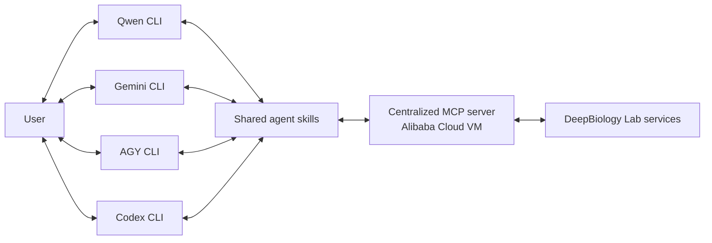

# DeepBiology Lab agent extensions

DeepBiology Lab connects AI coding agents to genomics workflows for studying
gene regulation, enhancer function, and mutation effects. This repository
contains a Python SDK, a centralized Model Context Protocol (MCP) integration,
and thirteen shared skills used by Qwen CLI, Gemini CLI, Antigravity (AGY), and
Codex CLI.

Qwen connects to a universal, centralized Streamable HTTP MCP server deployed
on an Alibaba Cloud VM. The same MCP service and canonical `skills/` tree also
support the other tested agents, so the workflows are portable rather than tied
to one agent runtime.

## Supported agents

Set the centralized MCP endpoint and your DeepBiology API key before starting
an agent. The URL must include `/mcp`.

```bash
export DEEPBIOLOGY_MCP_URL=https://<your-centralized-mcp-host>/mcp
export DEEPBIOLOGY_API_KEY=dbio_your_api_key_here
```

Each user supplies a separate API key. The extensions send it as an
`Authorization: Bearer` header on every request.

### Qwen CLI

Install the tested Qwen CLI extension directly from this repository:

```bash
qwen extensions install https://github.com/DeepBiology/deepbiology-lab
```

Qwen loads `qwen-extension.json`, the shared skills, and the centralized MCP
configuration.

### Gemini CLI

```bash
gemini extensions install https://github.com/DeepBiology/deepbiology-lab --auto-update
```

Gemini prompts for the MCP URL and API key during installation. Update them
later with `gemini extensions config deepbiology-lab`.

### Antigravity (AGY) CLI

```bash
agy plugin install https://github.com/DeepBiology/deepbiology-lab
```

AGY can also import an existing Gemini installation with
`agy plugin import gemini`.

### Codex CLI

```bash
codex plugin marketplace add DeepBiology/deepbiology-lab
codex plugin add deepbiology@deepbiology-marketplace
```

The published Codex plugin uses the same centralized MCP URL and reads its
Bearer token from `DEEPBIOLOGY_API_KEY`.

## DeepBiology Lab

DeepBiology Lab provides four complementary genomics workflows:

| Workflow | Question |
| --- | --- |
| **Q1 — Regulation** | How does predicted transcription change across genomic coordinates for a gene and cell line? |
| **Q2 — Enhancer importance** | Which nucleotides in a regulatory region are most important to the predicted signal? |
| **Q3 — Mutation impact** | How does a specified DNA sequence change affect predicted regulation or enhancer function? |
| **Q4 — Enhancer redesign** | Can an enhancer sequence be redesigned to optimize its predicted activity? |

The supporting tools also resolve gene aliases, model-specific cell-line
channels, known variants, and cancer mutations, and retrieve submitted job
results.

## Run a workflow with Qwen

Python 3.9 or newer is required for the SDK and optional local tools. Install
the package from GitHub:

```bash
pip install git+https://github.com/DeepBiology/deepbiology-lab.git
```

The published Qwen extension runs through the centralized MCP server, so it
does not need a local MCP process. After exporting `DEEPBIOLOGY_MCP_URL` and
`DEEPBIOLOGY_API_KEY` and installing the extension, start Qwen:

```bash
qwen
```

Then describe the analysis in natural language. For example:

```text
Run Q1 to analyze the transcription regulation of CD34 in Kasumi-1 cells.
```

```text
Find important enhancer positions near CD34, then explain how a mutation at a
high-importance position could change the predicted regulatory signal.
```

The agent selects the appropriate shared skill, resolves names and model
channels when necessary, submits the workflow, checks its status, and retrieves
the result. Equivalent prompts can be used with Gemini, AGY, and Codex.

## Shared skills

The root `skills/` directory is the canonical, agent-neutral source for all
thirteen skills.

| Skill | What it does |
| --- | --- |
| `deepbiology-setup` | Configure the SDK, API key, and MCP connection |
| `deepbiology-resolve-gene` | Resolve gene names and aliases to HGNC symbols |
| `deepbiology-resolve-cell-line` | Resolve model- and assay-specific cell-line channels |
| `deepbiology-list-models` | List supported model catalogs |
| `deepbiology-resolve-snps` | Find regional variants and annotate dbSNP identifiers |
| `deepbiology-cancer-mutations` | Query cancer-mutation annotations |
| `deepbiology-q1-regulation` | Run Q1 transcription-regulation analysis |
| `deepbiology-q2-enhancer-importance` | Run Q2 enhancer-importance analysis |
| `deepbiology-q3-mutation-impact` | Run Q3 mutation-impact analysis |
| `deepbiology-q4-enhancer-redesign` | Run Q4 enhancer-redesign analysis |
| `deepbiology-check-status` | Check a submitted job |
| `deepbiology-get-result` | Retrieve and explain a completed result |
| `deepbiology-download-result` | Save result JSON and optional image artifacts locally |

## Architecture

Qwen, Gemini, AGY, and Codex share the same skills and centralized MCP service.
The service is deployed on an Alibaba Cloud VM and authenticates every request
with the caller's DeepBiology API key.



The centralized server is the default. For local development, the package can
still run the MCP server over stdio:

```bash
deepbiology-lab config --api-key dbio_your_api_key_here
deepbiology-lab-mcp
```

Codex users can register that optional local server separately:

```bash
codex mcp add deepbiology-lab-local -- deepbiology-lab-mcp
```

## Notes

- Do not commit API keys. Each remote caller supplies its own key.
- `DEEPBIOLOGY_MCP_URL` must be the complete HTTPS endpoint, including `/mcp`.
- Remote agent calls return result data and signed image URLs; they do not write
  artifacts to the MCP server's filesystem.
- The SDK remains importable as `deepbiology`.
- The console scripts are `deepbiology-lab` and `deepbiology-lab-mcp`.

## License

This project is licensed under the [MIT License](LICENSE).
