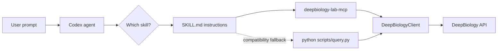

# deepbiology-lab

Python SDK, CLI, MCP server, and shared Codex, Gemini CLI, and Antigravity
(AGY) agent skills for DeepBiology Lab.

## Agent extensions

The root `skills/` directory is the canonical source for thirteen DeepBiology
skills shared by all supported agents. The Codex bundle is generated from that
source; do not edit `codex-plugin-python/skills/` directly.

Install the Gemini CLI extension:

```bash
gemini extensions install https://github.com/DeepBiology/deepbiology-lab --auto-update
```

Install the native AGY plugin:

```bash
agy plugin install https://github.com/DeepBiology/deepbiology-lab
```

Both local extensions require the `deepbiology-lab-mcp` executable provided by
this Python package. See `extension/README.md` for configuration and development
details.

## Quick install

**One-liner:**

```bash
curl -fsSL https://raw.githubusercontent.com/DeepBiology/deepbiology-lab/main/scripts/install.sh | sh
```

**Or with pip directly:**

```bash
pip install git+https://github.com/DeepBiology/deepbiology-lab.git
```

**Local development:**

```bash
git clone https://github.com/DeepBiology/deepbiology-lab.git
cd deepbiology-lab
pip install -e .
```

## Configure your API key

```bash
deepbiology-lab config --api-key dbio_your_api_key_here
```

Optional:

```bash
deepbiology-lab config --base-url https://us-central1-deepbiology-471514.cloudfunctions.net
deepbiology-lab config --show
```

Config is stored at:

```bash
~/.config/deepbiology-lab/config.json
```

## Run workflows

### Q1

```bash
deepbiology-lab run q1 --gene-name CD34 --cell-line 195 --download-image --image-path cd34.png
deepbiology-lab run q1 --gene-name CD34 --cell-name kasumi-1 --model borzoi_finetune_v1 --assay-type RNASeq
```

When `--cell-name` is supplied, the CLI resolves `(model, assay type, cell
name)` to the model's numeric output channel. `--assay-type` defaults to
`RNASeq`; an explicit `--cell-line` index remains supported.

By default the CLI prints the clean website-style JSON result. Use `--raw` to print the normalized raw API payload instead.

```bash
deepbiology-lab run q1 --gene-name CD34 --cell-line 195 --raw
```

### Q2

```bash
deepbiology-lab run q2 --gene-name CD34 --cell-line 195 --coordinate chr1:207923783-207923857
```

### Q3

```bash
deepbiology-lab run q3 --gene-name CD34 --cell-line 195 --coordinate chr1:207923783-207923857 --mutated-seq ATGGCCATGGCCATGGCCATGGCCATGGCC
```

### Q4

```bash
deepbiology-lab run q4 --gene-name CD34 --cell-line 195 --center 207923820 --flanking-size 75 --iterations 250 --download-image --image-path redesign.png
```

## Resolve model channels and variants

```bash
deepbiology-lab resolve kasumi-1 --model borzoi_finetune_v1 --assay-type RNASeq
deepbiology-lab snps region chr1:207923720-207923920 --assembly GRCh38 --max-results 50
deepbiology-lab snps impact rs1053802528 --assembly GRCh38
```

## Download completed job artifacts

```bash
deepbiology-lab download <jobId>
deepbiology-lab download <jobId> --download-image
```

The default result path is
`deepbiology-experiments/run_<jobId>/result_<jobId>.json`. With
`--download-image`, the image defaults to `result_<jobId>.png` in the same run
directory. Codex, Gemini, and AGY expose the same behavior through the
`deepbiology-download-result` skill and `download_job_result` MCP tool.

## Python usage

```python
from deepbiology import DeepBiologyClient
from deepbiology import annotate_variant, find_variants, resolve_cell_line

resolution = resolve_cell_line(
    "kasumi-1",
    model_id="borzoi_finetune_v1",
    assay_type="RNASeq",
)

regional_variants = find_variants("chr1:207923720-207923920", limit=50)
vep = annotate_variant("rs1053802528")

client = DeepBiologyClient(
    api_key="dbio_your_api_key_here",
    base_url="https://us-central1-deepbiology-471514.cloudfunctions.net",
)

job = client.submit_job("q1_regulation", {
    "task": "plot_transcription_gradient",
    "gene_name": "CD34",
    "cell_line": "195",
})

result = client.get_clean_result(job["jobId"])
print(result)
```

## MCP Server

The package includes an [MCP](https://modelcontextprotocol.io) (Model Context Protocol) server
that exposes DeepBiology Lab workflows as tools for LLM chatboxes — Claude Desktop,
VS Code Copilot Chat, Cursor, and any other MCP-compatible client.

### Tools

| Tool | Description |
|------|-------------|
| `resolve_gene` | Resolve a gene name/alias to canonical HGNC symbol (e.g. "cyclin D1" → `CCND1`) |
| `submit_q1_regulation` | Submit Q1 — plot transcription gradient |
| `submit_q2_enhancer_importance` | Submit Q2 — mutation importance scan |
| `submit_q3_mutation_impact` | Submit Q3 — test a specific mutated sequence |
| `submit_q4_enhancer_redesign` | Submit Q4 — AI-driven enhancer optimization |
| `get_job_status` | Check a job's current processing status |
| `get_job_result` | Retrieve completed result with data fields, tables, and image URL |

### Usage

```bash
# Set your API key (or use the shared CLI config from ~/.config/deepbiology-lab/config.json)
export DEEPBIOLOGY_API_KEY=dbio_your_api_key_here

# Start the MCP server over stdio
deepbiology-lab-mcp
```

### Configuration

The server checks these sources in order:

1. **Environment variables:** `DEEPBIOLOGY_API_KEY`, `DEEPBIOLOGY_BASE_URL`
2. **CLI config file:** `~/.config/deepbiology-lab/config.json`

### Adding to an MCP client

**Claude Desktop** (`claude_desktop_config.json`):

```json
{
  "mcpServers": {
    "deepbiology-lab": {
      "command": "deepbiology-lab-mcp",
      "env": {
        "DEEPBIOLOGY_API_KEY": "dbio_your_api_key_here"
      }
    }
  }
}
```

**VS Code Copilot** (`.vscode/mcp.json` or global settings):

```json
{
  "servers": {
    "deepbiology-lab": {
      "command": "deepbiology-lab-mcp",
      "env": {
        "DEEPBIOLOGY_API_KEY": "dbio_your_api_key_here"
      }
    }
  }
}
```

**Cursor:**

```json
{
  "mcpServers": {
    "deepbiology-lab": {
      "command": "deepbiology-lab-mcp",
      "env": {
        "DEEPBIOLOGY_API_KEY": "dbio_your_api_key_here"
      }
    }
  }
}

```

## Codex Plugin

This package also ships a [Codex](https://openai.com/codex/) plugin (boltz-compatible pattern)
that gives Codex agents the ability to submit and track DeepBiology Lab workflows via skills.

The plugin source is in the `codex-plugin-python/` directory of this repo.

### Skills

| Skill | What it does |
|-------|-------------|
| `deepbiology-setup` | Install the CLI package and configure API key |
| `deepbiology-resolve-gene` | Resolve gene names/aliases to HGNC symbols |
| `deepbiology-resolve-cell-line` | Resolve model- and assay-specific output-channel indices |
| `deepbiology-list-models` | List supported model catalogs |
| `deepbiology-resolve-snps` | Find regional variants and annotate rsIDs with VEP |
| `deepbiology-cancer-mutations` | Query aggregated cancer-mutation annotations |
| `deepbiology-q1-regulation` | Submit Q1 — transcription gradient analysis |
| `deepbiology-q2-enhancer-importance` | Submit Q2 — enhancer mutation importance scan |
| `deepbiology-q3-mutation-impact` | Submit Q3 — mutated sequence impact evaluation |
| `deepbiology-q4-enhancer-redesign` | Submit Q4 — AI-driven enhancer optimization |
| `deepbiology-check-status` | Check the status of a submitted job |
| `deepbiology-get-result` | Retrieve completed job results |
| `deepbiology-download-result` | Save result JSON and optional image artifacts locally |

### How to install

```bash
# Add the marketplace (from the git repo)
codex plugin marketplace add DeepBiology/deepbiology-lab
codex plugin add deepbiology@deepbiology-marketplace

# Set your API key
export DEEPBIOLOGY_API_KEY=dbio_your_api_key_here

# Now describe what you want in natural language —
# Codex will pick the right skill automatically
```

### Local development

```bash
# Point Codex at the local plugin directory
codex --plugin-dir ./codex-plugin-python
```

### Architecture

The canonical skills instruct Codex, Gemini, and AGY to call the shared MCP
tools. The MCP server delegates model catalogs, cell-line resolution, and
variant annotation to the SDK. The Codex-only `scripts/query.py` wrapper remains
available as a compatibility fallback for installations that do not load MCP.



### Expanding the plugin

To add a new skill:
1. Create a new directory under the canonical `skills/` tree with a `SKILL.md`
2. Add the workflow logic to `codex-plugin-python/scripts/query.py` (if a new workflow type)
3. Run `python scripts/sync_plugin_skills.py`
4. Add or update the shared MCP tool and tests as needed

To add a new alias to the gene resolver:
1. Edit `CURATED_ALIASES` in `codex-plugin-python/scripts/query.py`
2. Add a new line: `"ALIAS": "CANONICAL_SYMBOL",`

## Notes

- Package name: `deepbiology-lab`
- Console scripts: `deepbiology-lab` (CLI), `deepbiology-lab-mcp` (MCP server)
- Codex plugin: `codex-plugin-python/` directory (install via `codex plugin marketplace add DeepBiology/deepbiology-lab`)
- Importable Python client remains available as `deepbiology`

## License

This project is licensed under the [MIT License](LICENSE).
