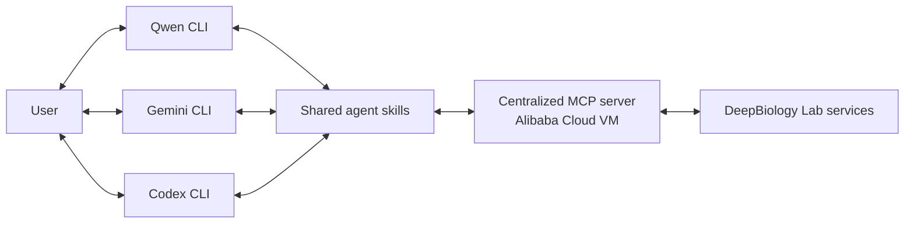

# DeepBiology Lab agent extensions

DeepBiology Lab helps researchers answer fundamental questions about gene regulation using natural-language prompts and LLM agents. These questions can range from "How is this gene regulated?" and "What is the effect of this cancer-associated mutation?" to "Can we devise approaches to reactivate this important tumor suppressor gene in cancer patients?"

This repository provides a Python SDK and agent extensions for Qwen, Gemini, and Codex. By default, these agents connect to a centralized Model Context Protocol (MCP) server that exposes 13 skills powered by the DeepBiology Python SDK. The service is accessed over HTTPS and is deployed on an Alibaba Cloud VM.

## DeepBiology Lab assays

DeepBiology Lab currently provides four gene-regulation analysis workflows:

| Workflow | Question |
| --- | --- |
| **Q1 — Regulation** | How does predicted transcription change across genomic coordinates for a gene and cell line? |
| **Q2 — Enhancer importance** | Which nucleotides in a regulatory region are most important to the predicted signal? |
| **Q3 — Mutation impact** | How does a specified DNA sequence change affect predicted regulation or enhancer function? |
| **Q4 — Enhancer redesign** | Can an enhancer sequence be redesigned to optimize its predicted activity? |

The extension also includes tools for resolving and normalizing gene names, cell-line names, variants, and cancer mutations before job submission.

## Installation

To use the extension, configure the environment variables below and install the extension for your agent. Installing the agents themselves is outside the scope of this guide. The Python SDK is optional for workflows that use the centralized MCP service.

### Set environment variables

Set the centralized MCP endpoint and your DeepBiology API key before starting an agent. The MCP server uses the API key to authenticate requests. The URL must include `/mcp`.

Sign in at [deepbiology.ai](https://deepbiology.ai) to create your DeepBiology API key. Contact [info@deepbiology.ai](mailto:info@deepbiology.ai) if you need help requesting an account or creating a DeepBiology API key. To request the MCP URL, contact [jinsongzhang@deepbiology.ai](mailto:jinsongzhang@deepbiology.ai). Replace the example MCP hostname below with the endpoint.

```bash
export DEEPBIOLOGY_MCP_URL=https://your-mcp-host.example/mcp
export DEEPBIOLOGY_API_KEY=dbio_your_api_key_here
```

### Install the optional DeepBiology Python SDK

Python 3.9 or newer is required for the SDK and optional local tools.

```bash
pip install git+https://github.com/DeepBiology/deepbiology-lab.git
```

To use the SDK or local tools, save your API key in the local configuration:

```bash
deepbiology-lab config --api-key dbio_your_api_key_here
```

This configuration step is not required for agent workflows that use the centralized MCP service.

### Install the DeepBiology extension

#### Qwen CLI

Run the following command and follow the prompts to enter the MCP URL and API key:

```bash
qwen extensions install https://github.com/DeepBiology/deepbiology-lab
```

#### Gemini CLI

Run the following command and follow the prompts to enter the MCP URL and API key:

```bash
gemini extensions install https://github.com/DeepBiology/deepbiology-lab --auto-update
```

#### Codex CLI

```bash
codex plugin marketplace add DeepBiology/deepbiology-lab
codex plugin add deepbiology@deepbiology-marketplace
codex mcp add deepbiology-lab \
  --url "$DEEPBIOLOGY_MCP_URL" \
  --bearer-token-env-var DEEPBIOLOGY_API_KEY
```

## Run an example workflow with Qwen

```bash
qwen
```

```text
Identify enhancers for the MYC gene in MCF7 cells.
```

## Skills

| Skill | What it does |
| --- | --- |
| `deepbiology-setup` | Configure the SDK, API key, and MCP connection |
| `deepbiology-resolve-gene` | Resolve gene names and aliases to HGNC symbols |
| `deepbiology-resolve-cell-line` | Resolve model- and assay-specific cell-line channels |
| `deepbiology-list-models` | List supported model catalogs |
| `deepbiology-resolve-snps` | Find regional variants and annotate dbSNP identifiers |
| `deepbiology-cancer-mutations` | Query cancer-mutation annotations |
| `deepbiology-q1-regulation` | Run Q1 transcription-regulation analysis |
| `deepbiology-q2-enhancer-importance` | Run Q2 enhancer-importance analysis |
| `deepbiology-q3-mutation-impact` | Run Q3 mutation-impact analysis |
| `deepbiology-q4-enhancer-redesign` | Run Q4 enhancer-redesign analysis |
| `deepbiology-check-status` | Check a submitted job |
| `deepbiology-get-result` | Retrieve and explain a completed result |
| `deepbiology-download-result` | Save result JSON and optional image artifacts locally |

## Architecture

Qwen, Gemini, and Codex share the same skills and a centralized MCP service. The service is deployed on an Alibaba Cloud VM and authenticates every request with the caller's DeepBiology API key.



## Notes

- `DEEPBIOLOGY_MCP_URL` must use the complete HTTPS endpoint, including `/mcp`.
- Do not commit API keys. Each user must supply their own key.

## License

This project is licensed under the [MIT License](LICENSE).
